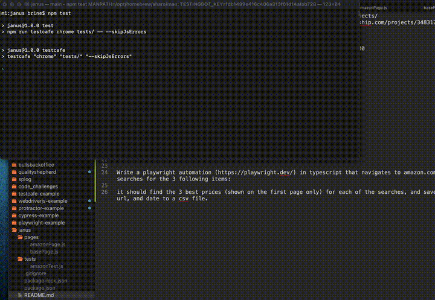

## Testcases
> a little e2e code challenge using [Testcafe](https://testcafe.io/)

Search Amazon for the following strings and ensure all results are over $100
- nvidia 3060
- nvidia 3070
- nvidia 3080

## Setup
1. clone `git clone git@github.com:qualityshepherd/janus.git`
2. install `npm i`

## Run
* run `npm test` to watch in browser, or
* `npm run ci` to run parallel, headless, on Chrome
* `npm run` to see more options

---

